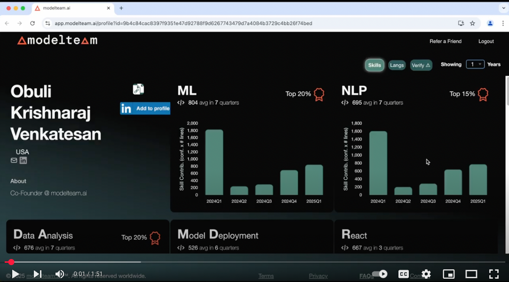

# modelteam: AI-Powered Skill Validation for Engineers

**[modelteam](https://modelteam.ai)** is an AI-driven platform that helps engineers validate and showcase their skills.
By analyzing real-world coding contributions, modelteam provides insights into expertise and code quality.

[View Sample Profile](https://app.modelteam.ai/profile?id=1da842a06520c30722ff3efb96d67a482cd689e6d43b87c882d4b690975a7c31)

modelteam is trained on contributions from over a million engineers across multiple open-source projects, supporting
analysis in **15+ programming languages**.

## Security & Privacy

Your code and data remain **on your local machine**. The AI models run locally, ensuring no data is transferred
externally. The generated profile contains only metadata and predicted skills, with an option to remove specific skills
before uploading.

## Supported Languages

Python, JavaScript, TypeScript, Java, Go, C, C++, PHP, Ruby, C#, Rust, Scala, Swift, Kotlin, Lua, Dart, Elixir

---

## Prerequisites

- Python 3.9 or higher
- Pip
- Python-venv (if not included in Python installation)
- Git (command line)
- Turn off sleep mode so the script can run without interruptions
    - Optional: caffeine (for linux)
- [Visual C++ Redistributable](https://learn.microsoft.com/en-us/cpp/windows/latest-supported-vc-redist?view=msvc-170) (
  for Windows)
- Minimum 8GB RAM
- ~15GB free disk space
- You should have made contributions for a **minimum period of 3 months**.

## Getting Started
### Video Tutorial
[](https://www.youtube.com/watch?v=s1MHhtoiMCk)

### Extract Skills & Stats from your Code to build your profile

- Create an account in [modelteam](https://app.modelteam.ai/) if you don't have one
- Run the following commands to generate your profile.
    - Our AI models run locally on your machine and does not send any data outside your machine.
    - Generates PDF profile for your personal use and a JSON file for creating your modelteam.ai verified profile

### 1. Install modelteam Locally (in a virtual environment)

<details open>
  <summary><b>Mac/Linux</b></summary>

```
mkdir ~/modelteam && cd ~/modelteam
git clone https://github.com/modelteam-ai/modelteam.ai.git
cd ~/modelteam/modelteam.ai
python3 setup.py
```
</details> 
<details> <summary><b>Windows</b></summary>

```
mkdir %USERPROFILE%\modelteam && cd %USERPROFILE%\modelteam
git clone https://github.com/modelteam-ai/modelteam.ai.git
cd %USERPROFILE%\modelteam\modelteam.ai
python setup.py
```
</details>

This script:

- Sets up a virtual environment. **So, it doesn't affect your system Python**
- Installs dependencies in the virtual environment
- Downloads AI models

### 2. Gather your Git Repositories & Git Email ID to Analyze
#### 2.1 Repo List

- Clone the repos to your local machine and add the full paths to a text file, one line for each repo.
- If all your repos are in a single directory, you can pass the directory path directly and skip the below step.


<details open>
  <summary><b>Mac/Linux</b></summary>

> $ ls /Users/john/repos/<br>
> backend<br>
> frontend<br>
> api

```
find ~ 2>/dev/null | grep "/\.git$" | sed 's/\/\.git$//' > ~/modelteam/repo_list.txt
```

> $ cat /Users/john/modelteam/repo_list.txt<br>
> /Users/john/backend<br>
> /Users/john/frontend<br>
> /Users/john/api

</details>
<details> <summary><b>Windows</b></summary>

> $ dir C:\Users\john\repos<br>
> backend<br>
> frontend<br>
> api

```
dir /s /b %USERPROFILE% | findstr "\\.git$" > %USERPROFILE%\modelteam\repo_list.txt
```

> $ type C:\Users\john\modelteam\repo_list.txt<br>
> C:\Users\john\backend<br>
> C:\Users\john\frontend<br>
> C:\Users\john\api

</details>


#### 2.2 Finding Your Git Email ID

- `git_email_id` should be the id you have in your git commits.
- You can get this by using `git log` command as shown below
  - Assuming your $USER (username) is there in your Author field

```
git config --get user.email
```

or

<details open>
  <summary><b>Mac/Linux</b></summary>

``` 
git log | grep Author | grep -i $USER | sed 's/.*<\(.*\)>.*/\1/' | sort | uniq 
```

> `$ git log | grep Author | grep $USER | sed 's/.*<\(.*\)>.*/\1/' | sort | uniq`<br>
> `1234567+john@users.noreply.github.com`<br>
> `john@org.ai`<br>

</details>
<details> <summary><b>Windows</b></summary>

```
git log --author=%USERNAME% --pretty=format:"%%ae"
```
</details>

### 3. Extract Skills from Your Code
- **This is to build profile for single user, to build team profile refer to [Team Profile Generation](README_org.md)**
- For this step, no internet access is required. The script will analyze your git history to extract skills and stats

<details open>
  <summary><b>Mac/Linux</b></summary>

```
cd ~/modelteam/modelteam.ai
python3 gen_git_stats.py -r <repo_list> -g <git_email_id> [-n <number_of_years_to_look_back>]
```

</details>
<details> <summary><b>Windows</b></summary>

```
cd %USERPROFILE%\modelteam\modelteam.ai
python gen_git_stats.py -r <repo_list> -g <git_email_id> [-n <number_of_years_to_look_back>]
```

</details>

- Number of years is optional and defaults to 5 years. It's recommended to change it to number of years you want to look
  back in git history

**Examples**

```
cd ~/modelteam/modelteam.ai
python3 gen_git_stats.py -r ~/modelteam/repo_list.txt -g john@org.ai -n 5
```

```
cd ~/modelteam/modelteam.ai
python3 gen_git_stats.py -r /Users/john/repos/ -g 1234567+john@users.noreply.github.com -n 5
```

- If you have multiple git email ids, you need to run the entire flow (except for setup.py) for each git email id
  separately
- **To Force re-run the job, delete the folder `model_team_profile/<git_email_id>` and run the script again**


### 4. Edit & Upload

<details open>
  <summary><b>Mac/Linux</b></summary>

```
python3 edit_skills.py -g <git_email_id> [--cli_mode]
```

</details>
<details> <summary><b>Windows</b></summary>

```
python edit_skills.py -g <git_email_id> [--cli_mode]
```

</details>
- Verify the generated skill stats file and edit it using [edit_skills.py](edit_skills.py) (Don't edit the JSON file
  directly)
    - Remove any confidential skills. Marking skills as irrelevant will help us improve our models
- Create an account in [modelteam](https://app.modelteam.ai/) if you don't have one
- Upload the file(mt_metrics_yyyy-mm-dd_*****.json.gz) back to your [experience](https://app.modelteam.ai/experience)
- Our AI models will analyze the data and generate a profile for you (<30 minutes)
- If you are using linux server without GUI, use --cli_mode

**Examples**

Mac/Windows

```
python3 edit_skills.py -g john@org.ai
```

Linux

```
python3 edit_skills.py -g 1234567+john@users.noreply.github.com --cli_mode
```

