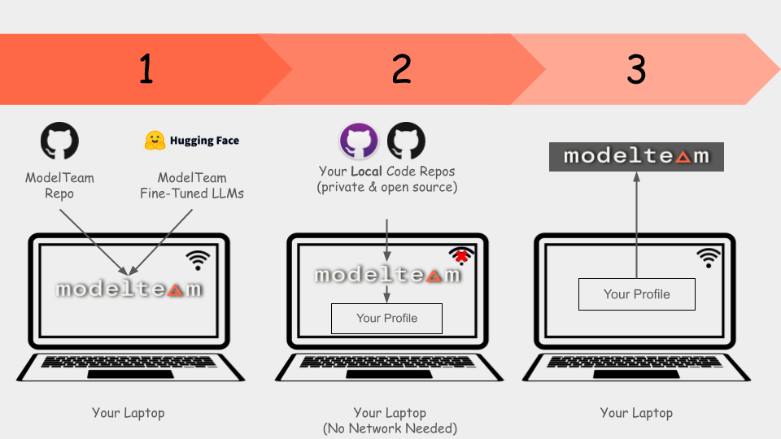

<div align="center">
  
</div>

**[ModelTeam](https://modelteam.ai)** is a cutting-edge AI-powered platform revolutionizing how engineers can validate & showcase their skills.
Our AI platform extracts insights from engineers' day-to-day work products, including code and technical documentation.
Thereby, ModelTeam provides a comprehensive and accurate assessment of engineers' skills, expertise, and coding quality.

ModelTeam is built on a robust foundation of training data from over a million engineers' contributions to open-source
projects, spanning 9 programming languages.

## Confidentiality & Security

We understand the importance of confidentiality and security of your code and data. ModelTeam.ai does not transfer any
of the code or data out of your local machine. Models and AI algorithms are downloaded to your local machine and the
code is executed locally.

The generated profile contains only the metadata and predicted skills. Even some of those skills can be removed before
uploading to modelteam.ai.

## Supported Languages

- Python
- Javascript
- Java
- Go
- C
- C++
- PHP
- Ruby
- C#

## Prerequisites

- Python 3.7 or higher
- Pip
- Python-venv (if not included in Python installation)
- Git (command line)
- Turn off sleep mode so the script can run without interruptions
    - Optional: caffeine (for linux)
- [Visual C++ Redistributable](https://learn.microsoft.com/en-us/cpp/windows/latest-supported-vc-redist?view=msvc-170) (for Windows)
- Minimum 8GB RAM
- ~15GB free disk space
- You should have made contributions for a **minimum period of 3 months**.

## Getting Started



- Run the following commands to generate your profile
    - **IMPORTANT: Run this in a night-time or when you are not using the computer as it will take some time and consume
      a lot of resources**
    - Our AI models run locally on your machine and does not send any data outside your machine.
    - Generates PDF profile for your personal use and a JSON file for creating your modelteam.ai verified profile

### 1. Setup

- Run the setup script to download the dependencies and models to your local machine

```bash
mkdir ~/modelteam
cd ~/modelteam
# Get the modelteam.ai code
git clone https://github.com/modelteam-ai/modelteam.ai.git
cd modelteam.ai
# Generates venv and installs dependencies. It will download all the AI models
python setup.py
```

### 2 Generate your skill stats

- For this step, no internet access is required. Everything stays on your local machine
- Add full local paths of your git repos to a text file. 1 line for each repo. e.g. `~/repo_list.txt` 

```bash
# Clone all your repositories that you want to include in your profile if it's not already cloned
$ cat ~/repo_list.txt
/Users/xyz/repos/shastraw.ai
/Users/xyz/repos/shastraw.server
/Users/xyz/repos/modelteam.ai
```

- Build your profile
- `email` should be the id/email you have in your git commits.
```bash
# Example:
git log | grep XYZ | head -3
Author: XYZ <userXYZ@org.ai>
Author: XYZ <1234567+XYZ@users.noreply.github.com>
Author: XYZ <userXYZ@org.ai>
```

```bash
# Generates your skill stats. Takes email used in git commits and optionally number of years to consider
# Number of years is optional and defaults to 5 years. It's recommended to change it to number of years you want to look back in git history
# repo_list can be a file with list of repos or a directory containing all the repos
python gen_git_stats.py -r <repo_list> -e <email/gitid> [-n <number_of_years_to_look_back>]
# e.g. python gen_git_stats.py -r ~/repo_list.txt -e userXYZ@org.ai -n 5
# e.g. python gen_git_stats.py -r /Users/xyz/repos/ -e 1234567+XYZ@users.noreply.github.com -n 5
```

### 3. Upload

- Verify the generated skill stats file and edit it using `sign_my_file.py` (Don't edit the JSON file directly)
    - Remove any unwanted/confidential skills
    - Sign the JSON file using the provided key
        - Key will be emailed to you when you sign up and add your experience in [modelteam.ai](https://app.modelteam.ai/experience)
        - This helps us to verify that you own the email address
        - If your git id is different from your email, it will be tagged for manual verification
- Upload the file(mt_metrics_yyyy-mm-dd_*****.json.gz) back to your experience
- Our AI models will analyze the data and generate a profile for you (<30 minutes)

```bash
# If you are using linux server without GUI, use --cli_mode
# key will be emailed when you create add your experience in https://app.modelteam.ai/experience
python sign_my_file.py -k <key> -e <email/gitid> [--cli_mode]
# e.g. python sign_my_file.py -k 2b7e151628aed2a6abf7158809cf4f3c -e userXYZ@org.ai # For MacOS/Windows
# e.g. python sign_my_file.py -k 2b7e151628aed2a6abf7158809cf4f3c -e 1234567+XYZ@users.noreply.github.com --cli_mode # For Linux
```
