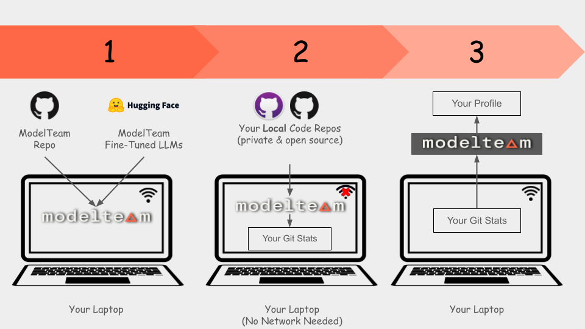

**ModelTeam** is a cutting-edge AI-powered platform revolutionizing how organizations hire and manage their engineering
talent. By precisely matching talents with responsibilities based on skill sets, ModelTeam optimizes the fit and
efficiency of engineering teams.

Our AI platform extracts insights from engineers' work products, including code and technical documentation.
These insights drive recruiting, talent calibration, training, and talent reallocation.

ModelTeam is built on a robust foundation of training data from over a million engineers' contributions to open-source
projects, spanning 50 thousand skills and 9 programming languages. Leveraging this extensive training data, ModelTeam
evaluates engineers' expertise across various skill domains, assesses coding quality, and ranks them among their peers,
ensuring your organization has the best talent in the right roles.

## Supported Languages

- Python
- Javascript
- Java
- Go
- C
- C++
- PHP
- Ruby
- C#

## Prerequisites

- Python 3.7 or higher
- Pip
- Python-venv (if not included in Python installation)
- Git (command line)
- MacOS or Linux
- caffeine (for linux). caffeinate (for MacOS, built-in)
- Minimum 8GB RAM
- ~15GB free disk space
- You should have made contributions for a minimum period of 6 months.
- Your email address should match the email address used in your git commits
  - We are working on supporting noreply email addresses

## Getting Started



- Create a folder `modelteam` and navigate to it.
- Create `modelteam/repos` folder
- Clone all the repositories you want to include in your profile to `modelteam/repos`
- Run the following command to generate your profile
    - **IMPORTANT: Run this in a night-time or when you are not using the computer as it will take some time and consume
      a lot of resources**
    - Generates PDF profile for your personal use and a JSON file for creating your modelteam.ai verified profile

```bash
# Step 1
mkdir modelteam;cd modelteam
# Get the modelteam.ai code
git clone https://github.com/modelteam-ai/modelteam.ai.git
cd modelteam.ai
# Generates venv and installs dependencies. It will download all the AI models
./setup.sh
# Clone / Copy all the repositories you want to include in your profile
mkdir repos;cd repos
git clone <repo1>
git clone <repo2>
...
...
cd ..
# Step 2
# For this step, internet access is not required
# Generates your profile. Takes email used in git commits and optionally number of years to consider
# Number of years is optional and defaults to 10 years. It's recommended to change it to your years of experience
./build_my_profile.sh modelteam/repos <email> [<number_of_years>]
# Verify the generated profile and remove any unwanted/confidential information
# Key will be emailed to you. JSON file will be encrypted using this key.
# If you are using linux server without GUI, use --cli_mode
./edit_and_sign.sh <key> [--cli_mode]

# Step 3
# Upload the encrypted json profile to modelteam.ai
```