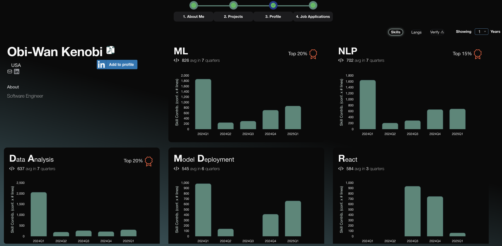

<div align="center">
  
</div>

# ModelTeam: AI-Powered Skill Validation for Engineers

**[ModelTeam](https://modelteam.ai)** is an AI-driven platform that helps engineers validate and showcase their skills.
By analyzing real-world coding contributions, ModelTeam provides insights into expertise and code quality.

[View Sample Profile](https://app.modelteam.ai/profile?id=1da842a06520c30722ff3efb96d67a482cd689e6d43b87c882d4b690975a7c31)

ModelTeam is trained on contributions from over a million engineers across multiple open-source projects, supporting
analysis in **15+ programming languages**.

## Security & Privacy

Your code and data remain **on your local machine**. The AI models run locally, ensuring no data is transferred
externally. The generated profile contains only metadata and predicted skills, with an option to remove specific skills
before uploading.

## Supported Languages

Python, JavaScript, TypeScript, Java, Go, C, C++, PHP, Ruby, C#, Rust, Scala, Swift, Kotlin, Lua, Dart, Elixir

---

## Prerequisites

- Python **3.9+**
- Pip & Python virtual environment (`python-venv`)
- Git (CLI)
- **Disable sleep mode** (Optional: Use `caffeine` on Linux)
- [Visual C++ Redistributable](https://learn.microsoft.com/en-us/cpp/windows/latest-supported-vc-redist?view=msvc-170) (
  Windows)
- Minimum **8GB RAM** & **15GB free disk space**
- At least **3 months** of coding contributions

---

## Getting Started

### 1. Install ModelTeam Locally

```sh
mkdir ~/modelteam && cd ~/modelteam
git clone https://github.com/modelteam-ai/modelteam.ai.git
cd modelteam.ai
python3 setup.py
```

This script:

- Sets up a **virtual environment**
- Installs **dependencies**
- Downloads **AI models**

### 2. Extract Skills from Your Code

```sh
python3 gen_git_stats.py -r <repo_list> -g <git_email_id> [-n <years_to_analyze>]
```

#### Defining Your Repositories

1. **Create a file with repository paths:**

   ```sh
   cat ~/repo_list.txt
   /Users/xyz/backend
   /Users/xyz/frontend
   /Users/xyz/api
   ```

2. **Or pass a directory containing repositories:**

   ```sh
   python3 gen_git_stats.py -r /Users/xyz/repos/ -g userXYZ@org.ai -n 5
   ```

    - *Note:* Subdirectories are not automatically included.

#### Finding Your Git Email ID

```sh
git log | grep Author | head
```

Example output:

```sh
Author: XYZ <userXYZ@org.ai>
Author: XYZ <1234567+XYZ@users.noreply.github.com>
```

Use the email inside `< >`.

#### Running the Skill Extraction Script

```sh
python3 gen_git_stats.py -r /Users/xyz/repo_list.txt -g userXYZ@org.ai -n 5
```

- Run separately for **each git email ID** if you have multiple.
- To **rerun**, delete `model_team_profile/<git_email_id>/`.

---

### 3. Upload Your Profile

#### Review & Edit Skills

```sh
python3 edit_skills.py -g <git_email_id> [--cli_mode]
```

Example:

```sh
python3 edit_skills.py -g userXYZ@org.ai
```

- Remove confidential skills.
- Mark skills as irrelevant to refine ModelTeam’s AI.

#### Upload to ModelTeam

1. **Sign up** at [ModelTeam](https://app.modelteam.ai/).
2. Navigate to [Experience](https://app.modelteam.ai/experience).
3. Upload `mt_metrics_yyyy-mm-dd_*****.json.gz`.
4. AI-generated profile will be ready in **<30 minutes**.

---

For **team-wide profile generation**, see [Team Profile Generation](README_org.md).

