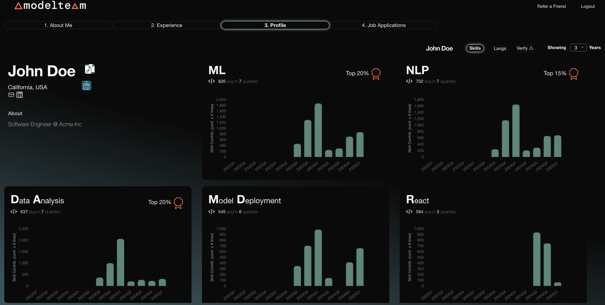
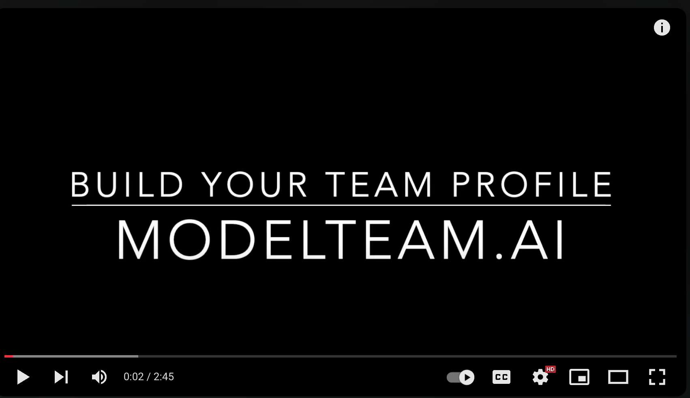

<div align="center">
  
</div>

# ModelTeam: AI-Powered Skill Validation for Engineers

**[ModelTeam](https://modelteam.ai)** is an AI-driven platform that helps engineers validate and showcase their skills.
By analyzing real-world coding contributions, ModelTeam provides insights into expertise and code quality. Our platform helps teams identify and retain top talent and ensures the best engineers are matched to the
right roles, optimizing performance and success.

[View Sample Profile](https://app.modelteam.ai/profile?id=1da842a06520c30722ff3efb96d67a482cd689e6d43b87c882d4b690975a7c31)

ModelTeam is trained on contributions from over a million engineers across multiple open-source projects, supporting
analysis in **15+ programming languages**.

## Security & Privacy

Your code and data remain **on your local machine**. The AI models run locally, ensuring no data is transferred
externally. The generated profile contains only metadata and predicted skills, with an option to remove specific skills
before uploading.

## Supported Languages

Python, JavaScript, TypeScript, Java, Go, C, C++, PHP, Ruby, C#, Rust, Scala, Swift, Kotlin, Lua, Dart, Elixir

---

## Prerequisites

- Python 3.9 or higher
- Pip
- Python-venv (if not included in Python installation)
- Git (command line)
- Turn off sleep mode so the script can run without interruptions
    - Optional: caffeine (for linux)
- [Visual C++ Redistributable](https://learn.microsoft.com/en-us/cpp/windows/latest-supported-vc-redist?view=msvc-170) (
  for Windows)
- You should have made contributions for a minimum period of 3 months.

### Compute Needs

- If your team is under 10, your laptop or small server should be sufficient.
- If your team is larger, you may need a server with more resources. We recommend using a server with at least 32GB RAM
  and 8 cores.
- Following is sample runtime. ~10 hours for analyzing ~1M lines of code. (32GB machine with 8 cores).

```mono
+---------------------------------+-------------+
| Metric                          |       Value |
|---------------------------------+-------------|
| Time taken                      | 566 minutes |
| Kinds of files analyzed         |          go |
| Number of repositories analyzed |           1 |
| Number of months analyzed       |          37 |
| Number of lines analyzed        |      949114 |
| Number of skills extracted      |          89 |
+---------------------------------+-------------+
```

## Getting Started

[](https://www.youtube.com/watch?v=JDGxgT9rwo0)

- Create an account in [modelteam](https://app.modelteam.ai/org/)
- Run the following commands to generate your profile
    - Our AI models run locally on your machine and does not send any data outside your machine.
    - Generates a JSON file for creating your modelteam.ai verified profile

### 1. Install ModelTeam Locally

```
mkdir ~/modelteam && cd ~/modelteam
git clone https://github.com/modelteam-ai/modelteam.ai.git
cd modelteam.ai
python3 setup.py
```

This script:

- Sets up a **virtual environment**
- Installs **dependencies**
- Downloads **AI models**

### 2. Gather your Git Repositories
#### Repo List

- Clone the repos to your local machine and add the full paths to a text file, one line for each repo.
- If all your repos are in a single directory, you can pass the directory path directly and skip the below step.

> $ ls /Users/john/repos/<br>
> backend<br>
> frontend<br>
> api

```
find ~ 2>/dev/null | grep "/\.git$" | sed 's/\/\.git$//' > ~/modelteam/repo_list.txt
```

> $ cat /Users/john/modelteam/repo_list.txt<br>
> /Users/john/backend<br>
> /Users/john/frontend<br>
> /Users/john/api

#### Finding Your Git Email ID (Skip this if you are building for the entire team)

- `git_email_id` should be the id you have in your git commits.
- You can get this by using `git log` command as shown below
  - Assuming your $USER (username) is there in your Author field

```
git config --get user.email
```

or

``` 
git log | grep Author | grep -i $USER | sed 's/.*<\(.*\)>.*/\1/' | sort | uniq 
```

> `$ git log | grep Author | grep $USER | sed 's/.*<\(.*\)>.*/\1/' | sort | uniq`<br>
> `1234567+john@users.noreply.github.com`<br>
> `john@org.ai`<br>

### 3. Extract Skills from Your Code
- **This is to build team profile, for individuals to fenerate their profiles, refer to [Profile Generation](README.md)**
- For this step, no internet access is required. Everything stays on your local machine
```
python3 gen_team_git_stats.py -r <repo_list> [-g "<gitemail1>,<gitemail2>,..."] -t "<team_name>" [-n <number_of_years>]
```
- Extract Team stats using [gen_team_git_stats.py](gen_team_git_stats.py). If your team is big, we recommend generating
  profiles only for the team members who are actively contributing to the repositories and are relevant to the team's skills.
- Generates your team profile. Takes a list of git email ids or team name and optionally number of years to consider
- Number of years is optional and defaults to 3 years. It's recommended to reduce it as per your needs

**Examples**
```
python3 gen_team_git_stats.py -r /Users/john/repos/ -t all_team -n 3
```
```
python3 gen_team_git_stats.py -r ~/repo_list.txt -g "user1@org.ai,user2@org.ai" -t part_team -n 3
```

- **To Force re-run the job, delete the folder `model_team_profile/<team_name>` and run the script again**

### 4. Upload

- Just upload the generated JSON file to create your team in https://app.modelteam.ai/org/teams
- Our AI models will analyze the data and generate a profile for your team (<30 minutes)

