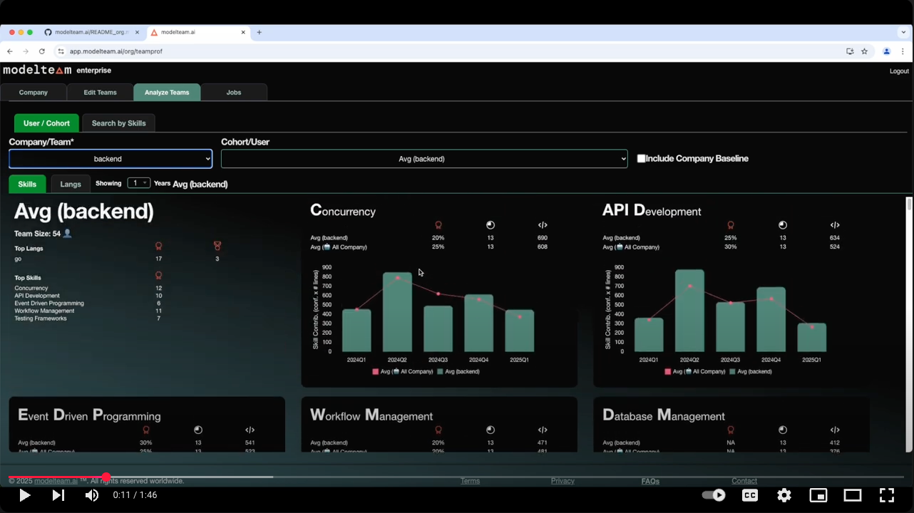

<div align="center">
  
</div>

At **[ModelTeam](https://modelteam.ai)**, we develop proprietary Large Language Models (LLMs) to evaluate engineers’
skills and
capabilities by examining code and technical documentations. We use these models, learned from a training set of
millions of engineers, to develop a unique data assets that powers a vertical talent insight platform for software
engineers. Our platform helps teams identify and retain top talent and ensures the best engineers are matched to the
right roles, optimizing performance and success.

Our AI platform extracts insights from engineering team's day-to-day work products, including code and technical
documentation. Thereby, ModelTeam provides a comprehensive and accurate assessment of engineers' skills, expertise, and
coding quality.

ModelTeam is built on a robust foundation of training data from over a million engineers' contributions to open-source
projects, spanning 9 programming languages.

## Confidentiality & Security

We understand the importance of confidentiality and security of your code and data. ModelTeam.ai does not transfer any
of the code or data out of your local machine. Models and AI algorithms are downloaded to your local machine and the
code is executed locally.

The generated profile contains only the metadata and predicted skills. Even some of those skills can be removed before
uploading to modelteam.ai.

## Supported Languages

- Python
- Javascript
- Java
- Go
- C
- C++
- PHP
- Ruby
- C#

## Prerequisites

- Python 3.7 or higher
- Pip
- Python-venv (if not included in Python installation)
- Git (command line)
- Turn off sleep mode so the script can run without interruptions
    - Optional: caffeine (for linux)
- [Visual C++ Redistributable](https://learn.microsoft.com/en-us/cpp/windows/latest-supported-vc-redist?view=msvc-170) (for Windows)
- You should have made contributions for a minimum period of 3 months.

### Compute Needs

- If your team is under 10, your laptop or small server should be sufficient.
- If your team is larger, you may need a server with more resources. We recommend using a server with at least 32GB RAM
  and 8 cores.
- Following is sample runtime. ~10 hours for analyzing ~1M lines of code. (32GB machine with 8 cores).

```mono
+---------------------------------+-------------+
| Metric                          |       Value |
|---------------------------------+-------------|
| Time taken                      | 566 minutes |
| Kinds of files analyzed         |          go |
| Number of repositories analyzed |           1 |
| Number of months analyzed       |          37 |
| Number of lines analyzed        |      949114 |
| Number of skills extracted      |          89 |
+---------------------------------+-------------+
```

## Getting Started

[](https://www.youtube.com/watch?v=JDGxgT9rwo0)

**For Individuals to Generate their profiles, refer to [Profile Generation](README.md)**

- Run the following commands to generate your profile
    - **IMPORTANT: Run this in a night-time or when you are not using the computer as it will take some time and consume
      a lot of resources**
    - Our AI models run locally on your machine and does not send any data outside your machine.
    - Generates a JSON file for creating your modelteam.ai verified profile

### 1. Setup

- Run [setup.py](setup.py) to download the dependencies and models to your local machine
- This will create a virtual environment and install all the dependencies. It will not affect your system python.


```bash
mkdir ~/modelteam
cd ~/modelteam
# Get the modelteam.ai code
git clone https://github.com/modelteam-ai/modelteam.ai.git
cd modelteam.ai
# Generates venv and installs dependencies. It will download all the AI models
python setup.py
```

### 2 Generating Team Stats

- For this step, no internet access is required. Everything stays on your local machine
- Clone the repo to your local machine and add the full paths to a text file, one line for each repo. e.g. `~/repo_list.txt`. This file will be used later as input.
  - Alternatively, if all your repos are in a single directory, you can pass the directory path directly.
```bash
# Clone all your repositories that you want to include in your profile if it's not already cloned
$ cat ~/repo_list.txt
/Users/xyz/repos/shastraw.ai
/Users/xyz/repos/shastraw.server
/Users/xyz/repos/modelteam.ai
```

- Extract Team stats using [gen_team_git_stats.py](gen_team_git_stats.py). If your team is big, we recommend generating profiles only for the team members who are
  actively contributing to the repositories and are relevant to the team's skills.
- `git_id` should be the id you have in your git commits.
  - You can get this by using `git log` command as shown below
  - Text between <> is the git_id e.g. Author: XYZ <**userXYZ@org.ai**>
```bash
git log | grep XYZ | head -3
Author: XYZ <userXYZ@org.ai>
Author: XYZ <1234567+XYZ@users.noreply.github.com>
Author: XYZ <userXYZ@org.ai>
```

```bash
# Generates your team profile. Takes a list of git ids or team name and optionally number of years to consider
# Number of years is optional and defaults to 3 years. It's recommended to reduce it as per your needs
# repo_list can be a file with list of repos or a directory containing all the repos
python gen_team_git_stats.py -r <repo_list> [-g "<gitid1>,<gitid2>,..."] -t "team_name" [-n <number_of_years>]
# e.g. python gen_team_git_stats.py -r ~/repo_list.txt -g "user1@org.ai,user2@org.ai" -t model_team -n 3
# e.g. python gen_team_git_stats.py -r /Users/xyz/repos/ -t model_team -n 3
```

### 3. Upload

- Just upload the generated JSON file to create your team in https://app.modelteam.ai/org/teams
- Our AI models will analyze the data and generate a profile for your team (<30 minutes)

